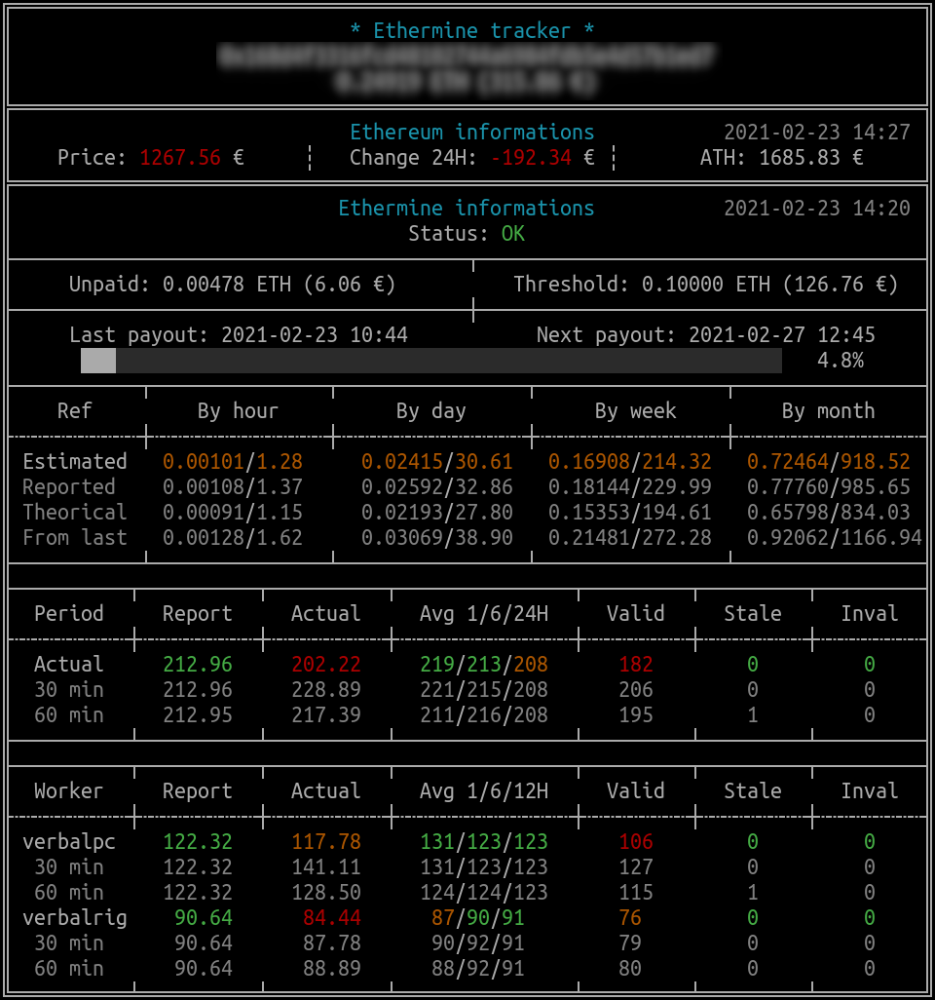

# Ethermine tracker CLI

[](https://www.codefactor.io/repository/github/verbalinsurection/etherminetrackercli)
[](https://sonarcloud.io/dashboard?id=Verbalinsurection_EthermineTrackerCLI)

> :warning: **Work in progress** :warning: : Code work but need a lot of optimizations. **Feel free to participate !**

## Introduction

> Python script to track your mining informations on terminal using **curses** focus on ethermine result.



Informations :

- Wallet value - From [Etherscan](https://etherscan.io/) (need etherscan API key)
- Ethereum price, evolution, ATH - From [Coingecko](https://www.coingecko.com/)
- Ethermine wallet - From [Ethermine](https://ethermine.org/)
  - Unpaid income
  - Treshold
  - Date of last payout
  - *Calculated next payout (based on 6h average real hashrate) - From [Coincalculators](https://www.coincalculators.io)*
  - Progression for next payout
  - *Estimated income (based on 6h average real hashrate) and compared to :*
    - *Estimated income based on reported hashrate*
    - *Estimated income based on graphic card theorical hashrate (you have to set this in config file). The goal is to compare the income to a no optimized CG raw hashrate from Coincalculators result*
  - Reported hashrate, actual, historical data over 3 range, shares
  - Workers informations

## Python informations

### Version

Write using Python 3.8, have to check with other version.

### Dependency

- [schedule==1.0.0](https://pypi.org/project/schedule/)
- *Windows users* - [windows-curses==2.2.0](https://pypi.org/project/windows-curses/)

## Configuration

Copy `config_sample.cfg` to `config.cfg` and update with your informations.

### config.cfg example

```ini
[Tracker]
Wallet = 0x000000000000000000000000
Etherscan_API = XXXXXXXXXXXXXXXXXXXXXXX
Fiat_Name = eur
Fiat_symbol = €
Theorical_hrate = 180.2
Api_Update_Seconds = 60
```

`Fiat_name` must be in coingecko list

## Yeah :wink: you can donate but there is no real reson to do this

- ETH : 0x168d4f3316fcd48102744a6984fdb5e4d57b1ed7 (you can target your rig to this for some minutes on ethermine :) )
- TRX : TLLBe2pvo3WcxPMALjpJySursJQiHQ48yu
- BTC : 12VVvqiimyaew5SskgzkWsVwnXARR83iE6
- XRP : rLADRnxwS5M7LFgrC9zmn3jmU9Vnc98Dh9
- ZEC : t1b26RYTcq77YYuyTsvfbFktYKoTN4QmFiz
